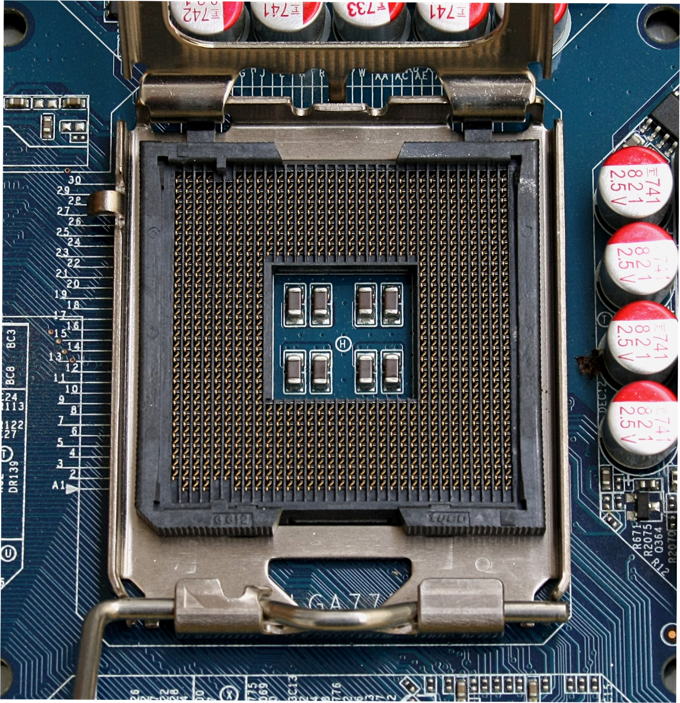

# The Mainboard 💻

- [The Mainboard 💻](#the-mainboard-)
  - [Presentation on Canva](#presentation-on-canva)
  - [Definition of the mainboard](#definition-of-the-mainboard)
  - [Types of mainboards](#types-of-mainboards)
  - [Parts on the mainboard](#parts-on-the-mainboard)
- [Commercial Models of (Motherboards)](#commercial-models-of-motherboards)
  - [Mainstream Consumer Models](#mainstream-consumer-models)
  - [Enthusiast and Overclocking Models](#enthusiast-and-overclocking-models)
  - [Workstation Motherboards](#workstation-motherboards)
  - [Server Motherboards](#server-motherboards)
  - [Mini and Compact Boards](#mini-and-compact-boards)
  - [Specialized Boards](#specialized-boards)
- [1. **Internal connections**](#1-internal-connections)
  - [Power connectors:](#power-connectors)
  - [Data connectors:](#data-connectors)
  - [Expansion connectors:](#expansion-connectors)
- [2. **External connections**](#2-external-connections)
- [OLD](#old)
  - [A: PS/2 Connection](#a-ps2-connection)
  - [B: PS/2 Connection](#b-ps2-connection)
  - [C: PS/2 Connection](#c-ps2-connection)
  - [D: USB Connections](#d-usb-connections)
  - [E: 6 Channel Sound](#e-6-channel-sound)
  - [F: Ethernet connection](#f-ethernet-connection)
  - [G: 4 Pin Firewire Connection](#g-4-pin-firewire-connection)
  - [H: 6 Pin Firewire Connection](#h-6-pin-firewire-connection)
  - [I: Coaxial S/PDIF Output Connection](#i-coaxial-spdif-output-connection)
  - [J: LPT1 Port](#j-lpt1-port)
  - [K: DVI-D Port](#k-dvi-d-port)
  - [L: D-Sub Port](#l-d-sub-port)
- [NEW 🆕](#new-)
  - [USB](#usb)
  - [HDMI/DisplayPort/VGA](#hdmidisplayportvga)
  - [Ethernet](#ethernet)
  - [Analog/Digital Audio](#analogdigital-audio)
- [MAC](#mac)
  - [Authors](#authors)
  
## Presentation on Canva

- Presentation  -- > [Visit the presentation on Canva](https://www.canva.com/design/DAGYUbQxNEM/euH8xIe9aWqntbOBmjnR3Q/view?utm_content=DAGYUbQxNEM&utm_campaign=designshare&utm_medium=link2&utm_source=uniquelinks&utlId=hba5e50553f)

## Definition of the mainboard 
The mainboard/the motherboard, is the `primary circuit board of a computer or other complex systems`. It is the central hub for communication between all other 
hardware components such as processor, memory, and peripherals. It also houses the BIOS (Basic Input/Output System), the computer’s software to start up and operate. 
Each mainboard comes outfitted with specific sockets and ports connecting these components.

## Types of mainboards
There are a lot of types of mainboards but the most common type of mainboard used nowdays is the `ATX` and his variants like the Mini-ATX and the Micro-ATX.

## Parts on the mainboard
* **Chipset**
 Is a set of electronic components on one or more integrated circuits that manages the data flow between the processor, memory and peripherals.

* **North bridge and South bridge:**
The northbridge handles the high-speed communication between the CPU, memory, and graphics card, while the southbridge manages the slower 
input/output (I/O) operations and connects devices like hard drives (HD), universal serial bus (USB) devices, and audio interfaces.

* **Ram slots:**
RAM slots or sockets on a PC motherboard are long channels, generally located close to the CPU. There are clasps on each end of the socket, 
which will snap tight around the edge of the RAM when plugged in. RAM slots are often found in pairs and are sometimes color-coded for identification. 
We should note that RAM slots in a desktop look different than RAM slots in a laptop.

* **CPU socket:**
A CPU socket uses a series of pins to connect a CPU’s processor to the PC’s motherboard. If a CPU is connected via a CPU socket, 
it is not soldered and can therefore be replaced.

* **BIOS chip**
Is a fundamental component of computers, embedded in the motherboard to perform critical booting operations.

* **AGP slots**
Is a high-speed interface used in computers to connect graphics cards to the motherboard. AGP provided faster data transfer rates than traditional peripheral component interconnect (PCI) slots, allowing for better graphics performance and more realistic visuals in gaming and other graphical applications.

* **PCI slots**
Is a type of slot that allows you to add additional cards to your computer system. These slots are typically used to add sound cards, network cards, or other types of interface cards.

* **CNR slots**
Is a slot found on certain personal computer motherboards and used for specialized networking, audio, or telephony equipment.

* **SATA slots**
Is a computer interface standard that allows for the transfer of data between storage devices, such as hard disk drives (HDDs), solid-state drives (SSDs), and optical drives, and a computer's motherboard.

* **FCD**
Is responsible for reading data presented from the host computer and converting it to the drive's on-disk format using one of a number of encoding schemes.

* **CMOS Battery**
Is a small, coin-shaped battery found on a computer's motherboard. It provides power to the CMOS chip, which stores important system information such as the date, time, and hardware settings in the CMOS memory.

# Commercial Models of (Motherboards) 

## Mainstream Consumer Models 

These models are designed for `everyday use, gaming, and general-purpose PCs`. They offer a balance of price and performance for a wide range of users.

**Examples:**
- ASUS TUF Gaming series -- > [Visit the official page of this motherboard](https://www.asus.com/us/motherboards-components/motherboards/tuf-gaming/)
- MSI MAG series -- > [Visit the official page of this motherboard](https://us.msi.com/Motherboard/MAG-X870-TOMAHAWK-WIFI)

**Key Features:**
* Support for consumer-grade CPUs (e.g., Intel Core i-series, AMD Ryzen).
* Integrated RGB lighting, Wi-Fi support, and multiple PCIe slots.
* Price range: budget-friendly to high-end.

---

## Enthusiast and Overclocking Models

Built for power users, these mainboards offer `advanced features for gaming and professional workloads, including overclocking`.

**Examples:**
- ASUS ROG (Republic of Gamers) series  -- > [Visit the official page of this motherboard](https://www.asus.com/us/motherboards-components/motherboards/rog-republic-of-gamers/)
- MSI MEG series -- > [Visit the official page of this motherboard](https://us.msi.com/Motherboard/MEG-Z490-ACE)

**Key Features:**
* Enhanced cooling solutions and robust power phases.
* Extreme overclocking support for CPUs and GPUs.
* High-end audio chips and advanced I/O options.

---

## Workstation Motherboards

Designed for professional workloads like `3D rendering, CAD, and scientific computing, workstation motherboards focus on stability and performance`.

**Examples:**
- ASUS Pro WS series -- > [Visit the official page of this motherboard](https://www.asus.com/motherboards-components/motherboards/workstation/pro-ws-w790-ace/)
- Gigabyte W-series -- > [Visit the official page of this motherboard](https://www.gigabyte.com/Motherboard/W480-VISION-W-rev-10#kf)

**Key Features:**
* Support for high-core-count CPUs (e.g., Intel Xeon, AMD Threadripper).
* ECC memory compatibility for error correction.
* Multiple PCIe slots for specialized add-ons and GPUs.

---

## Server Motherboards

Server motherboards are optimized for `enterprise environments, focusing on scalability, reliability, and remote management`.

**Examples:**
- Supermicro Server Boards -- > [Visit the official page of this motherboard](https://www.supermicro.com/en/products/motherboards/server-boards)
- ASUS Server Motherboards -- > [Visit the official page of this motherboard](https://www.asus.com/us/motherboards-components/motherboards/tuf-gaming/)

**Key Features:**
* Support for multiple CPUs and ECC memory.
* Advanced network connectivity and RAID storage support.
* Designed for rack-mounted or tower servers.

---

## Mini and Compact Boards

Compact motherboards are ideal for `small form factor builds, such as home theater PCs or minimalist setups`.

**Examples:**
- ASUS ROG Strix B760-I Gaming (Mini-ITX) 
- Gigabyte Z690I AORUS Ultra -- > [Visit the official page of this motherboard](https://www.gigabyte.com/Motherboard/Z690I-AORUS-ULTRA-DDR4-rev-10#kf)

**Key Features:**
* Small form factors (e.g., Mini-ITX, Micro-ATX).
* Integrated Wi-Fi, Bluetooth, and low power consumption.
* Space-saving designs for compact systems.

---

## Specialized Boards

Specialized motherboards cater to unique needs like `industrial applications, cryptocurrency mining, or AI workloads`.

**Examples:**
- **Industrial Motherboards:** Ruggedized models (e.g., AAEON). -- > [Visit the official page of this motherboard](https://www.aaeon.com/en/product/list/industrial-motherboards)
- **Mining Motherboards:** Optimized for cryptocurrency mining (e.g., ASUS B250 Mining Expert). -- > [Visit the official page of this motherboard](https://www.asus.com/us/supportonly/b250%20mining%20expert/helpdesk_knowledge/)

**Key Features:**
* Rugged designs for harsh environments (industrial boards).
* Multiple PCIe slots for GPUs (mining boards).
* AI-specific interfaces and support for accelerators.

# 1. **Internal connections**
## Power connectors:
  These include the ATX connector. They provide power to the CPU, memory, and other components on the motherboard.

## Data connectors:
These include the SATA connectors, which are used to connect storage devices like hard drives and solid state drives, and the IDE connectors, which are used to connect older storage devices like PATA hard drives.

- SATA connector:

- IDE connector:
 

- PATA hard drive:

## Expansion connectors:
- These include the PCI Express (PCIe) slots, which are used to add expansion cards like graphics cards, network cards, and sound cards, and the PCI slots, which are used to add older expansion cards.

# 2. **External connections** 
# OLD 
  

## A: PS/2 Connection
 - This is where you can plug in a `PS/2 mouse`

 
  
  

 ## B: PS/2 Connection
 - This is where you can plug in a `PS/2 keyboard`

 ## C: PS/2 Connection
- This connection provides digital audio out to an external audio system that supports digital optical audio

 ## D: USB Connections
 - Connection for `USB`
  
  

 ## E: 6 Channel Sound
- This will be for the `computer's speakers` and `microphone`

 ## F: Ethernet connection
- This is where you will plug in your `internet connection`

 ## G: 4 Pin Firewire Connection
 - This is usually `used for external hard drive connections` or other high speed devices

 ## H: 6 Pin Firewire Connection
 - This is also usually used for external hard drive connections or other high speed devices

 ## I: Coaxial S/PDIF Output Connection
 - This connection provides digital audio out to an external audio system that supports digital coaxial audio

 ## J: LPT1 Port
 - This is used for `printer connection`
  

 ## K: DVI-D Port
 - This is used for `LCD monitor connectionse`

 ## L: D-Sub Port
 - This is used for `CRT monitor connections`

# NEW 🆕

## USB
- Connection for USB
  

## HDMI/DisplayPort/VGA
- They’re all video or display connectors to output video or audio
  

## Ethernet
- Connection for internet
  

## Analog/Digital Audio
- Connections for speakers and digital audio equipment

# MAC 

## Authors

- **Dafne Cabrera** 
 

- **Elias Maatalat** 

- **Lucilene Vidal**

